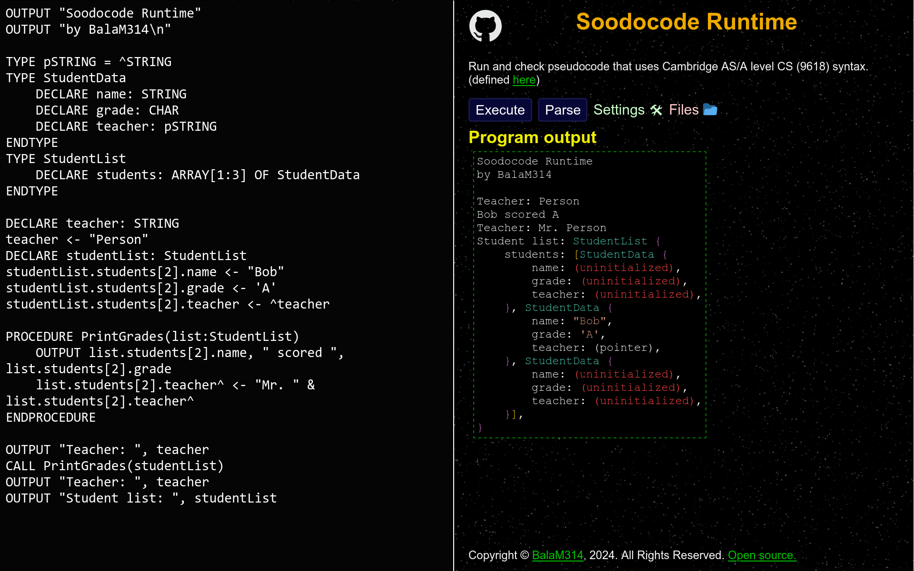

# Soodocode

Soodocode: a runtime for Cambridge CS (9618) pseudocode syntax, written in Typescript.

## Website

[Click here to view the site](https://balam314.github.io/soodocode)

## CLI

Installation: `npm i -g soodocode-cli`

Usage: `soodocode file.sc`

[More demos](./programs/demos/demos.md)

# Features

## Statements
* [x] DECLARE, DEFINE, CONSTANT, Assignment, OUTPUT, INPUT, RETURN, CALL, TYPE
* [x] IF, ELSE, FOR, FOR STEP, WHILE, REPEAT
* [x] CASE OF statements
* [x] Case branch with range
* [x] FUNCTION, PROCEDURE
* [x] CLASS, CLASS INHERITS, Class property, Class procedure, Class function

## Operators
* [x] or and equal_to not_equal_to less_than less_than_equal greater_than greater_than_equal not
* [x] add subtract negate multiply divide integer_divide mod
* [x] string_concatenate
* [x] pointer_reference pointer_dereference access

## Builtin functions
* [x] LEFT, RIGHT, MID/SUBSTRING, TO_UPPER, TO_LOWER, UCASE, LCASE
* [x] NUM_TO_STR, STR_TO_NUM, IS_NUM, ASC, CHR, INT
* [x] DAY, MONTH, YEAR, DAYINDEX, SETDATE, TODAY/NOW
* [x] LENGTH() on arrays and strings
* [x] RAND

## Arrays
* [x] n-dimensional arrays
* [x] Arrays with size determined by runtime-evaluated expressions
* [x] Arrays with generic size
  * [x] in function arguments
  * [x] in function return types
  * [x] in class fields
  * [x] behind pointers

## Types
* [x] Enums
* [x] Records
* [x] Pointers
  * [x] Infinite pointer types
* [x] Recursive types
* [x] Sets
* [ ] Set operations
* [x] Integer range type (1..10, 200..250)
* [x] Sound type system
  * Type checking is partly done at compile time (class inheritance, type esize check) and partly at runtime (everything else).

## Classes
* [x] Classes
* [x] Public/private class members
* [x] Inheritance
* [x] SUPER in classes

## Files
* [x] OPENFILE READFILE WRITEFILE CLOSEFILE statements
* [x] READ WRITE APPEND file modes
* [ ] SEEK GETRECORD PUTRECORD statements, RANDOM file mode
* [x] File GUI
* [x] EOF() function

## Misc
* [x] Passing by value/reference for all variable types
* [x] Shortened forms (for variable declaration and function arguments)
* [x] Robust, hundreds of error messages
* [x] Typo checking
* [x] Error ranges (underline the exact cause of the error, highlight the area around it)
* [x] Configurable
* [x] Allows any words as identifiers (except pseudocode keywords), including `for`, `__proto__`, and `hasOwnProperty`

## User interface
* [x] Minimalistic
* [x] Create, view, edit, delete, upload, and download files
* [x] All features accessible with only the keyboard

## More information
For a full list of features, see [features.md](docs/features.md)

For some discussion of advanced language features, see [notes.md](docs/notes.md)
